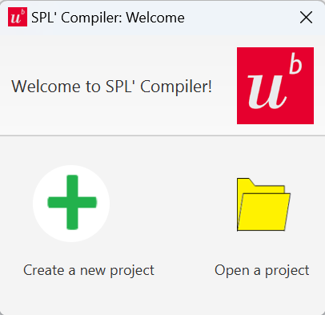
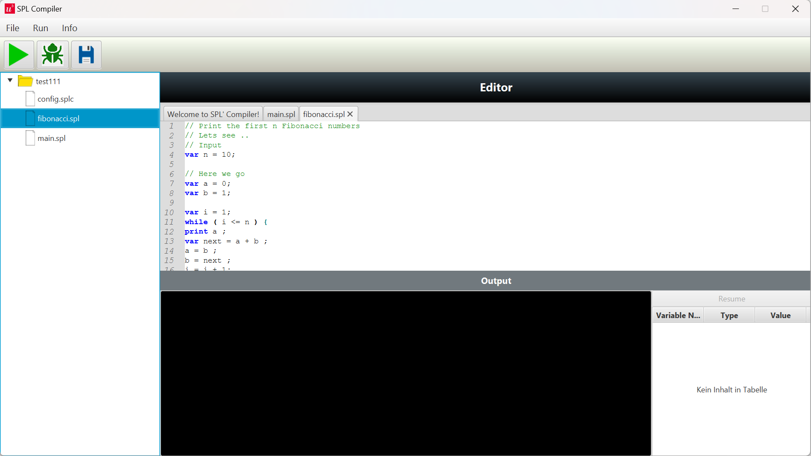
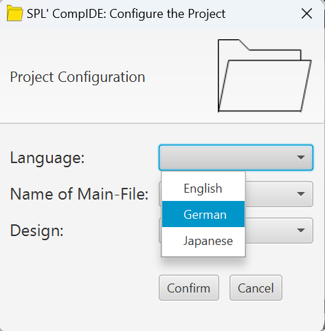
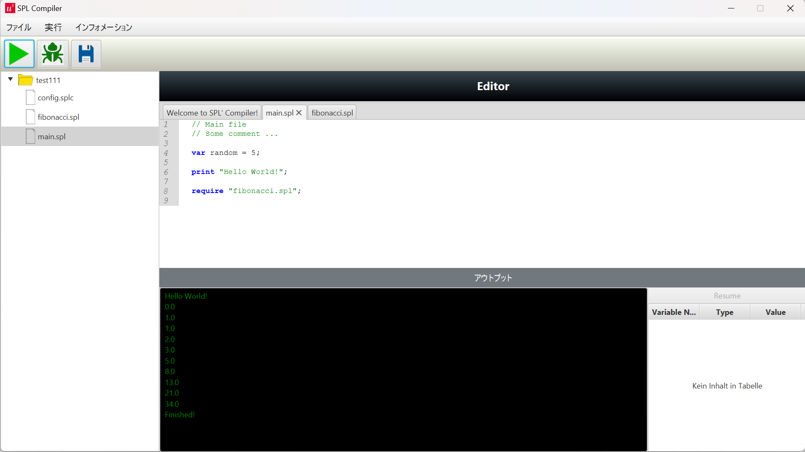
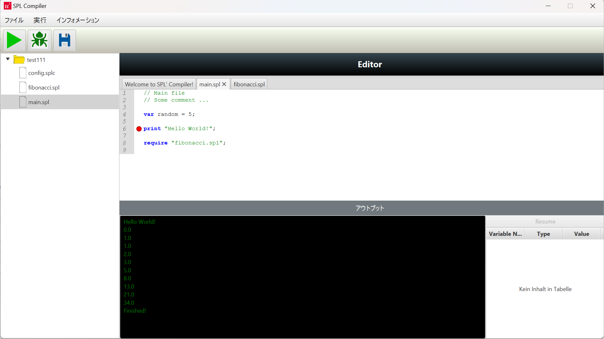
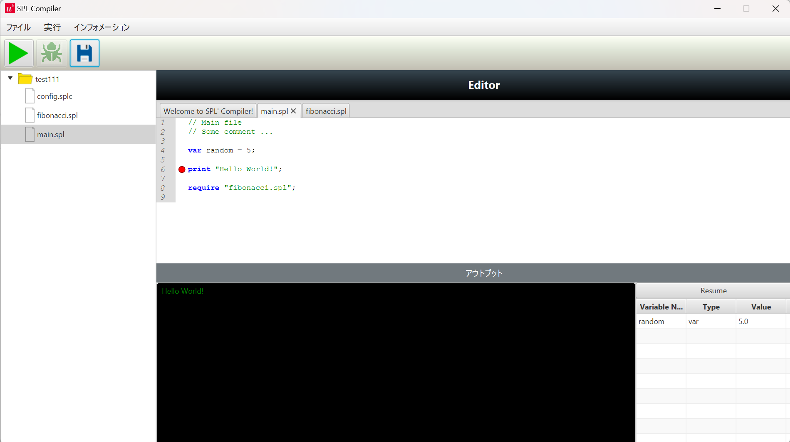
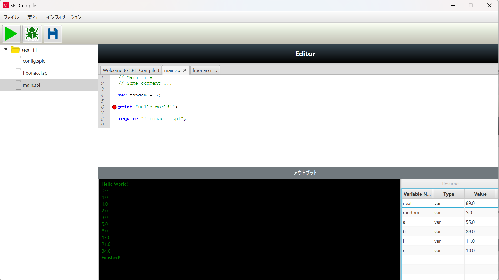

# SPL' Compiler
The project contains an (mini) IDE with an integrated compiler for the fictive programming Language SPL Prime.
For a detailed explanation of the SPL' language, please take a look at the [Wiki](../../wiki)

## Overview
* [Technologies](#technologies)
* [Features](#features)
* [Current status](#current-status)

## Technologies 

* 
* 
* 
* 
* 

## Features

### Start the software

Under releases you can find the first release of the program tagged as v1. Before you download the SPLCompiler.jar file and start it on your computer, make sure that you've an up-to-date java version installed on your machine (version 21.0 +)

After starting the application the program first asks if you'd like to create a new project or work on an existing one.

### Writing a program

In the textbar below the `Editor`-label you can write your program in SPL' prime. The following program of calculating the first n fibonacci numbers serves as an example:

### Configuration

CompIDE offers multi-language support as well as expandability for future designs. You can either modify the `config.splc` configuration file directly or use the configuration Dialog under `File -> Configuration` to do it, as in the following example:

In the dialog you can change the name of the main-file, choose between `English`, `German` or `Japanese` as the editor's Language and you can also set the preffered design for CompIDE. As of now, there's only the Standard-Design supported. However, if you'd like add your own design, CompIDE offers an API to smoothly integrate your own implementation.
In this tutorial, we are changing the language from `English` to `Japanese`, the other fields are left unchanged.

### Execution of a program

As soon as you click on the menu Run -> Run program the program will be executed. Depending of the size and structure of your program this might take some time.

If the syntax of your program is correct you should receive the output as in the following image:

Despite the generated output, the editor's language also switched from English to Japanese, as intended. The application also offers a mode for debugging as depicted in the screenshot below:

By clicking next to a code-line in your main-file you can set a breakpoint to conduct a type-inspection at this location of your code. 

After the click on the Debugging-Tool the program stops at the choosen location, the initialized variables at the current point are shown at the right lower side in the type inspection UI. If you want to continue the execution you can press the resume-Button on top of it, like in the example below:

## Current status
Finished

