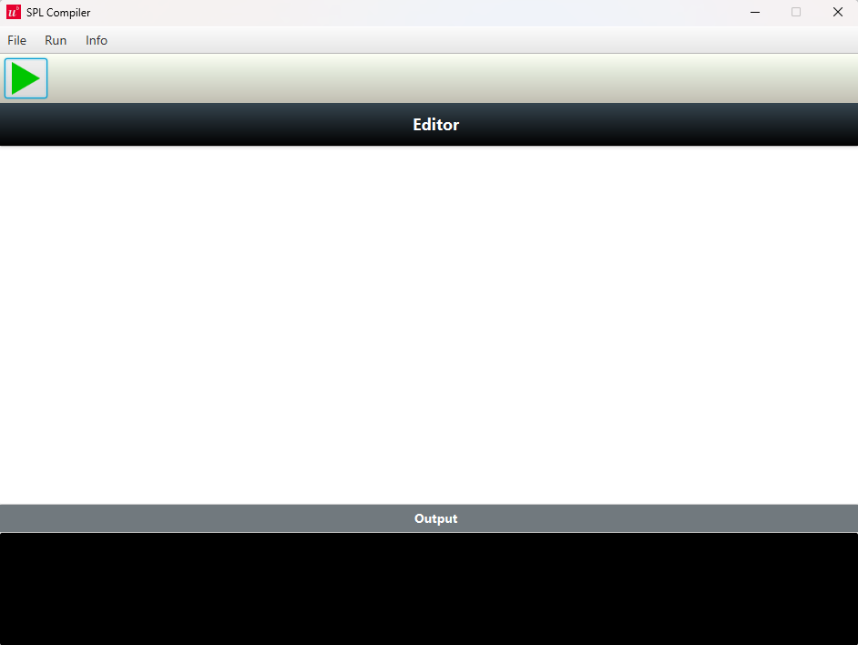
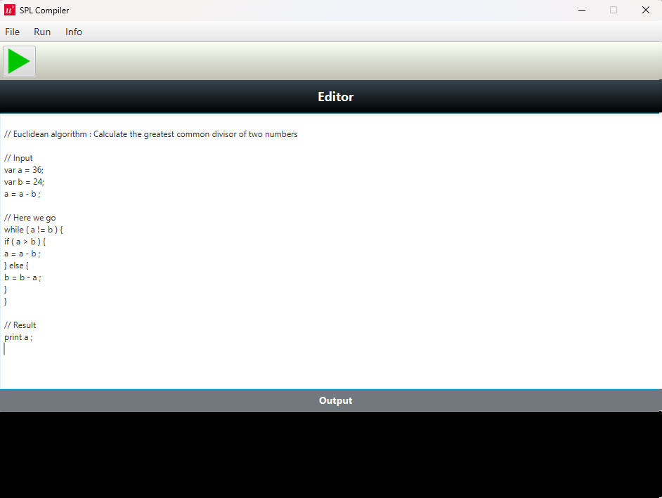
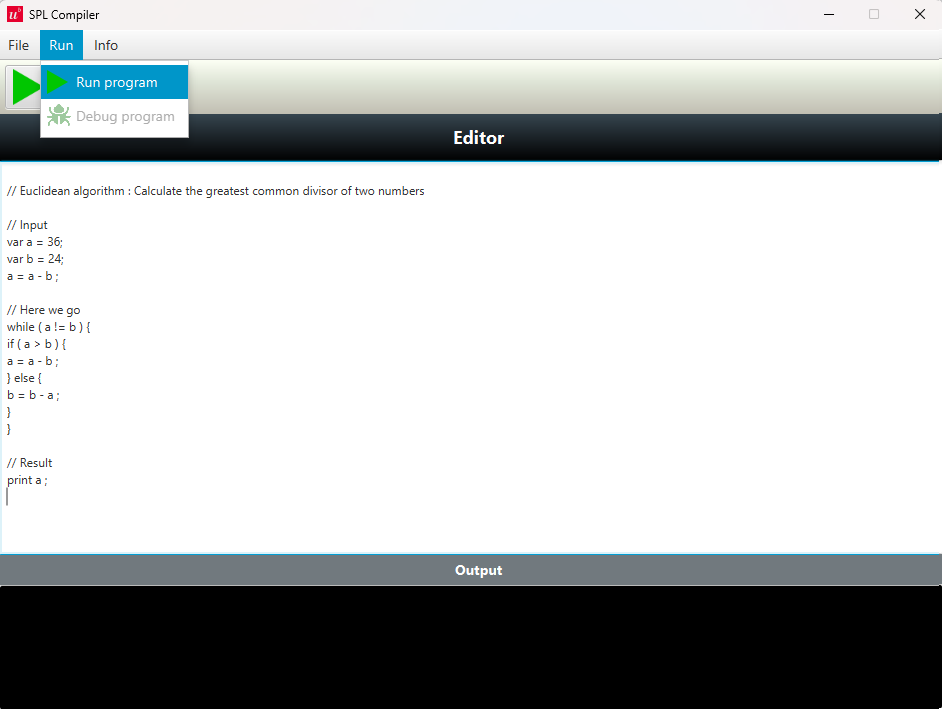
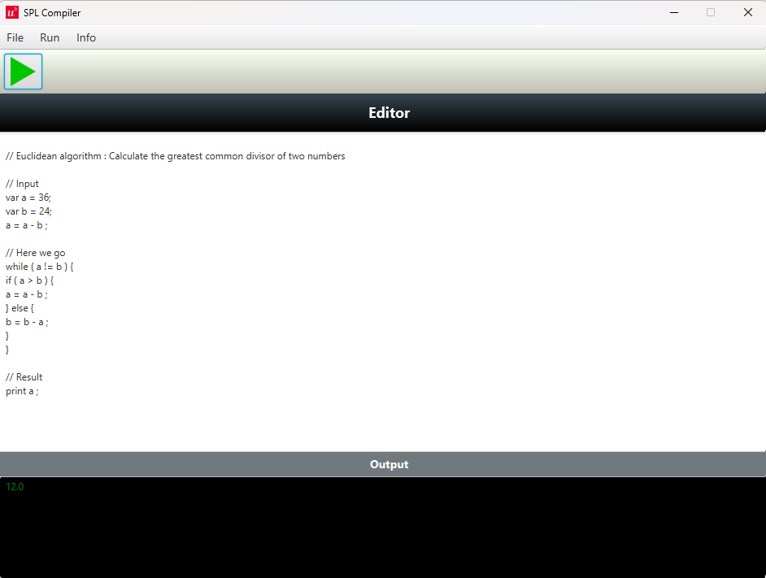

# SPL' Compiler
The project contains an (mini) IDE with an integrated compiler for the fictive programming Language SPL Prime.
For a detailed explanation of the SPL' language, please take a look at the [Wiki](../../wiki)

## Overview
* [Technologies](#technologies)
* [Features](#features)
* [Current status](#current-status)

## Technologies 

* 
* 
* 
* 
* 

## Features

### Start the software

Under releases you can find the first release of the program tagged as v1. Before you download the SPLCompiler.jar file and start it on your computer, make sure that you've an up-to-date java version installed on your machine (version 21.0 +)

### Writing a program

In the textbar below the `Editor`-label you can write your program in SPL' prime. The following program of the euclidean algorithm serves as an example:

As soon as you click on the menu Run -> Run program the program will be executed. Depending of the size and structure of your program this might take some time.

If the syntax of your program is correct you should receive the output as in the following image:

## Current status
In Development.

